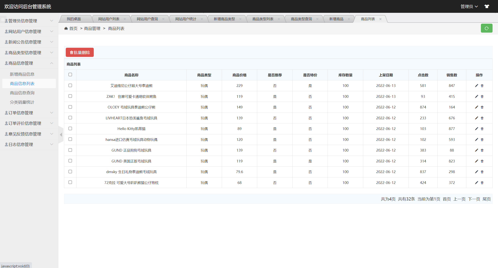
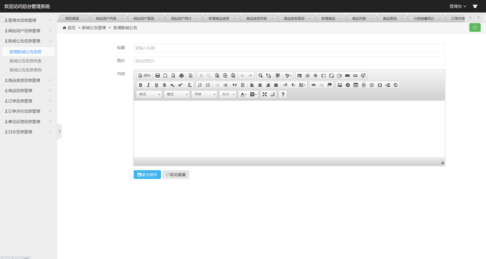

## 基于SSM的在线玩具商城系统

###  获取sql数据库文件: 从戎源码网 (https://armycodes.com/) QQ: 386869957 QQ群: 377586148
###  所有系统地址: (https://github.com/YuLin-Coder/AllProjectCatalog) 
###  所有项目以及源代码本人均调试运行无问题 可支持远程安装部署调试、定制修改、代码讲解

## 项目介绍
基于SSM的在线玩具商城系统，有用户和管理员两个角色，主要功能如下
用户：玩具商品浏览、商品分类查看、商品下单、购物车、个人信息等
管理员：用户管理、新闻公告、管理商品类型管理、商品信息管理、订单信息管理、订单评价管理、意见反馈管理、日志信息管理

## 项目技术
- 编程语言：Java
- 数据库：MySQL
- 前端技术：JSP、h-ui、Jquery、echart
- 后端技术：Spring、SpringMVC、MyBatis

## 运行环境
- JDK版本：JDK1.8及以上
- 开发工具：IDEA、Ecplise、Myecplise都可以
- 数据库: MySQL5.7及以上

## 运行截图

